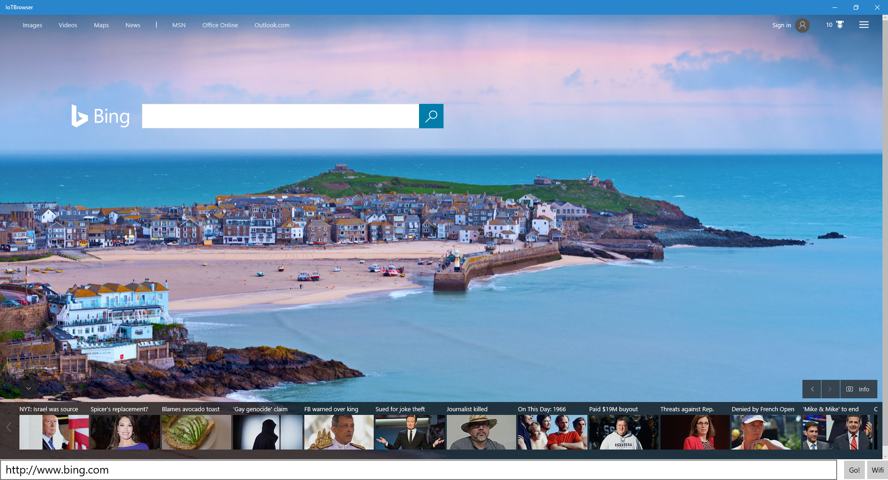

# IotBrowser background
From [Microsoft Win10 IOT Browser example](https://github.com/ms-iot/samples/tree/develop/IoTBrowser), a sample implementation of a web browser for Windows 10 IoT.

This is useful if going to a conference or something else similar and you want to bring a digital device with a small security target footprint yet still have access to the internet.

It has been tested on a Raspberry Pi 3 (ARM SOC) and an Intel Compute Stick (Intel Atom SOC). Performance seems better on the Intel SOC.

# Deploying
You can load the solution in Visual Studio and deploy to Remote machine (the IOT device). 

Additionally, you can right click on the solution and go to Store, Create App Pakages to build the APPX package. A sample is in the release.

The APPX package can be deployed via the webpage (http://IOTHOST:8080) and upload the APPXBundle package and Dependencies.

After deployed, you need to set the app to be default for startup.

# Use
Once deployed and set as the default app, whenever power is applied to the IOT device, the browser will launch.

